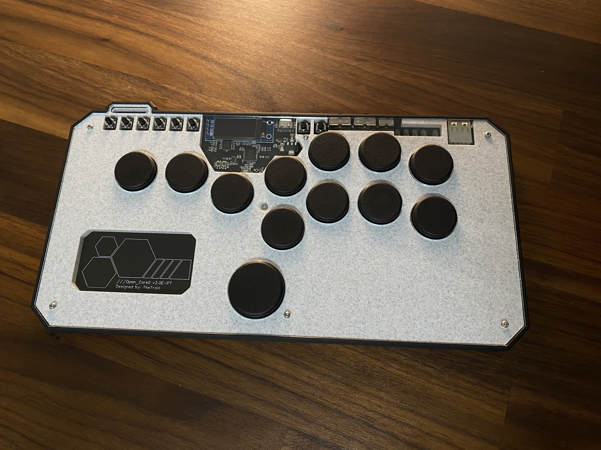
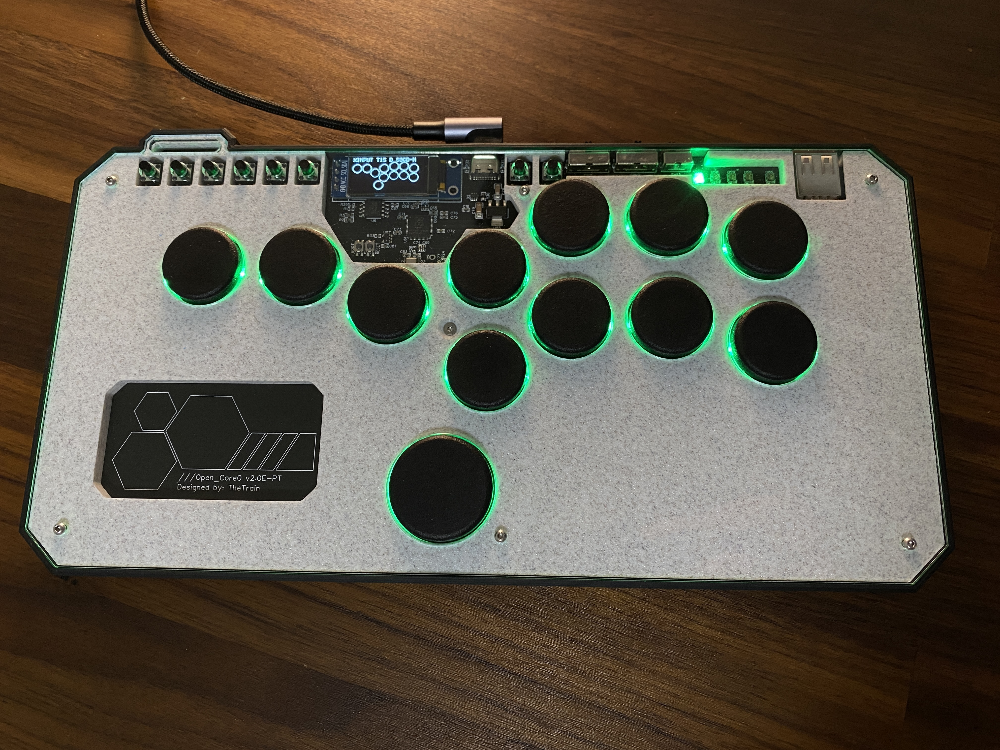
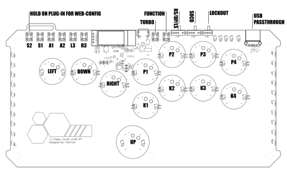
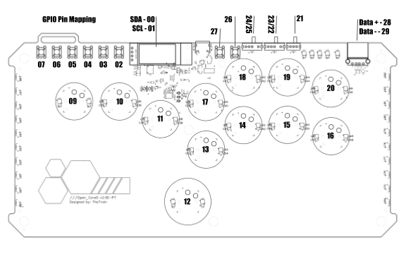
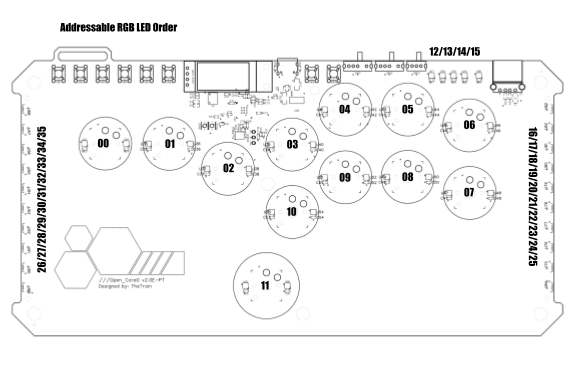

# GP2040-CE | OpenCore0

Standalone build repo for the [OpenCore0](https://github.com/OpenStickCommunity/Hardware/tree/main/Boards/GP2040-CE%20Official%20Controllers/Open_Core0) board config for [GP2040-CE](https://github.com/OpenStickCommunity/GP2040-CE).

## Downloads

Prebuilt `.uf2` firmware is attached to the [Releases](../../releases) page, tagged to match the upstream GP2040-CE release it was built from.

Layout for the Open_Core0

GPIO mapping for the Open_Core0

Addressible RGB LED order for the Open_Core0

You can find the full Open_Core0 hardware project [HERE](https://github.com/OpenStickCommunity/Hardware/tree/main/Boards/GP2040-CE%20Official%20Controllers/Open_Core0).

### Main Pin Mapping Configuration

| RP2040 Pin | Action                        | GP2040 | Xinput | Switch | PS3/4/5  | Dinput | Arcade |
|------------|-------------------------------|--------|--------|--------|----------|--------|--------|
| GPIO_PIN_12| GpioAction::BUTTON_PRESS_UP   | UP     | UP     | UP      | UP      | UP     | UP     |
| GPIO_PIN_10| GpioAction::BUTTON_PRESS_DOWN | DOWN   | DOWN   | DOWN    | DOWN    | DOWN   | DOWN   |
| GPIO_PIN_11| GpioAction::BUTTON_PRESS_RIGHT| RIGHT  | RIGHT  | RIGHT   | RIGHT   | RIGHT  | RIGHT  |
| GPIO_PIN_09| GpioAction::BUTTON_PRESS_LEFT | LEFT   | LEFT   | LEFT    | LEFT    | LEFT   | LEFT   |
| GPIO_PIN_13| GpioAction::BUTTON_PRESS_B1   | B1     | A      | B       | Cross   | 2      | K1     |
| GPIO_PIN_14| GpioAction::BUTTON_PRESS_B2   | B2     | B      | A       | Circle  | 3      | K2     |
| GPIO_PIN_15| GpioAction::BUTTON_PRESS_R2   | R2     | RT     | ZR      | R2      | 8      | K3     |
| GPIO_PIN_16| GpioAction::BUTTON_PRESS_L2   | L2     | LT     | ZL      | L2      | 7      | K4     |
| GPIO_PIN_17| GpioAction::BUTTON_PRESS_B3   | B3     | X      | Y       | Square  | 1      | P1     |
| GPIO_PIN_18| GpioAction::BUTTON_PRESS_B4   | B4     | Y      | X       | Triangle| 4      | P2     |
| GPIO_PIN_19| GpioAction::BUTTON_PRESS_R1   | R1     | RB     | R       | R1      | 6      | P3     |
| GPIO_PIN_20| GpioAction::BUTTON_PRESS_L1   | L1     | LB     | L       | L1      | 5      | P4     |
| GPIO_PIN_06| GpioAction::BUTTON_PRESS_S1   | S1     | Back   | Minus   | Select  | 9      | Coin   |
| GPIO_PIN_07| GpioAction::BUTTON_PRESS_S2   | S2     | Start  | Plus    | Start   | 10     | Start  |
| GPIO_PIN_03| GpioAction::BUTTON_PRESS_L3   | L3     | LS     | LS      | L3      | 11     | LS     |
| GPIO_PIN_02| GpioAction::BUTTON_PRESS_R3   | R3     | RS     | RS      | R3      | 12     | RS     |
| GPIO_PIN_05| GpioAction::BUTTON_PRESS_A1   | A1     | Guide  | Home    | PS      | 13     | ~      |
| GPIO_PIN_04| GpioAction::BUTTON_PRESS_A2   | A2     | ~      | Capture | ~       | 14     | ~      |

## How the automated build works

1. A scheduled job polls the latest release of `OpenStickCommunity/GP2040-CE` every 6 hours (also runs on manual dispatch and on pushes to this repo).
2. If the upstream tag is newer than the last release published here, the build job checks out GP2040-CE at that tag plus the pinned `pico-sdk` version it expects.
3. `BoardConfig.h`, `Open_Core0.h` and `assets/` from this repo are copied into `configs/OpenCore0/` of that checkout, overwriting the upstream copy.
4. The firmware is built with `GP2040_BOARDCONFIG=OpenCore0`, and the resulting `.uf2` is uploaded as a workflow artifact and attached to a new release tagged with the upstream version.

See [.github/workflows/build.yml](.github/workflows/build.yml).

## Credits

Config originally maintained in [OpenStickCommunity/GP2040-CE](https://github.com/OpenStickCommunity/GP2040-CE/tree/main/configs/OpenCore0). All firmware source, licensing and credits belong to that project — see their [README](https://github.com/OpenStickCommunity/GP2040-CE/blob/main/README.md) and [LICENSE](https://github.com/OpenStickCommunity/GP2040-CE/blob/main/LICENSE).
